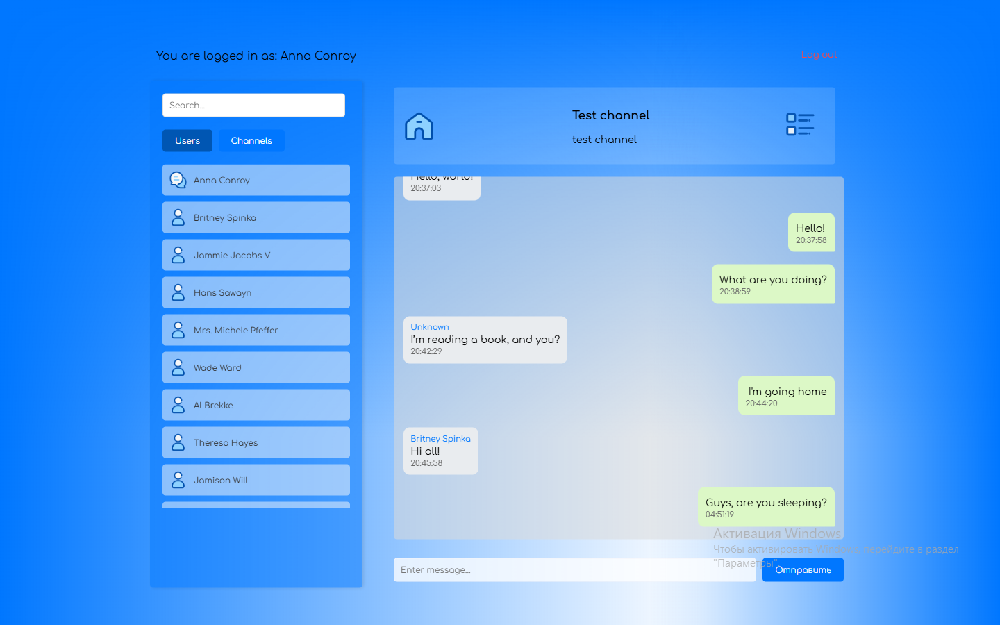

# Real-time-chat

Live chat with channel support, personal profiles and authentication system

[](https://reactjs.org/)
[](https://socket.io/)
[](https://opensource.org/licenses/MIT)
[](https://glitch.com/)

A multifunctional web application for real-time communication with support for channels and personal chats.

[Demo version](https://debonair-parallel-dish.glitch.me/)



## Peculiarities ✨

- 🔐 Authentication system (registration/login)
- 💬 Real chat with channel support
- 👥 User profile management
- 🛠 Create/delete channels
- 🔎 Search by users and channels
- 👥 Display of participants in correspondence
- 🌐 WebSocket for instant messages
- 📱 Nice interface

## Technologies 🛠️

**Client:**
- React 18
- React DOM
- Socket.io Client
- Babel Standalone

**Server:**
- Express.js
- Socket.io Server
- CORS
- Body-parser

**Data storage:**
- JSON-файлы (users.json, channels.json)
- LocalStorage для сессий

## Installation and launch ⚙️

### Prerequisites
- Node.js v16+
- npm 9+

1. Clone the repository:
```bash
cd appchat
```
Install dependencies:

```bash
npm install
```
Start the server and client:
```bash
npm start
```
The application will be available at: http://localhost:3000

**Using 💻**

1.Registration/Login

- Fill out the registration form

- Use your login details

2.Main interface

- Left: list of users and channels

- Right: Active chat and channel/profile information

3.Channel management

- Creating new channels (the "Create a channel" button in the channels section)

- Member management (for administrators (Channel Creator))

- Deleting channels

**Link**

- Author: [MrKrabsArt]() - t.me/Mrkrabsart 👨💻
- Support: [Mail]() - kajkovartem20@gmail.com ✉️
- Telegram channel: [link]() - t.me/lMrKrabsArtl 💻
- Contribution: PR and suggestions are welcome! 🤝
