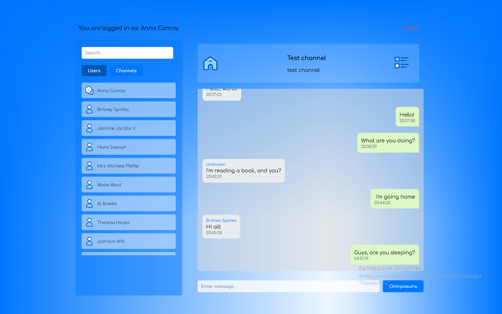

# React Chat Application 🚀

[](https://reactjs.org/)
[](https://socket.io/)

A multifunctional web application for real-time communication with support for channels and personal chats.



## Peculiarities ✨

- 🔐 Authentication system (registration/login)
- 💬 Real chat with channel support
- 👥 User profile management
- 🛠 Create/delete channels
- 🔎 Search by users and channels
- 👥 Display of participants in correspondence
- 🌐 WebSocket for instant messages
- 📱 Nice interface

## Technologies 🛠️

**Client:**
- React 18
- React DOM
- Socket.io Client
- Babel Standalone

**Server:**
- Express.js
- Socket.io Server
- CORS
- Body-parser

**Data storage:**
- JSON-файлы (users.json, channels.json)
- LocalStorage для сессий

## Installation and launch ⚙️

### Prerequisites
- Node.js v16+
- npm 9+

1. Clone the repository:
```bash

cd appchat
```
Install dependencies:

```bash
Copy
npm install
```
Start the server and client:

```bash
Copy
npm run start:server
npm run start:client
```
The application will be available at: http://localhost:3000

Usage 💻
1.Register/Login

- Fill out the registration form
  
- Use your login details
  
2.Main interface
  
- Left: list of users and channels
  
- Right: active chat and channel/profile information

3.Manage channels

- Create new channels ("Create a channel" button in the channels section)
  
- Manage members (for admins(Channel creator))
  
- Delete channels

### Author: [MrKrabsArt] 👨💻
### Contributions: PRs and suggestions are welcome! 🤝
